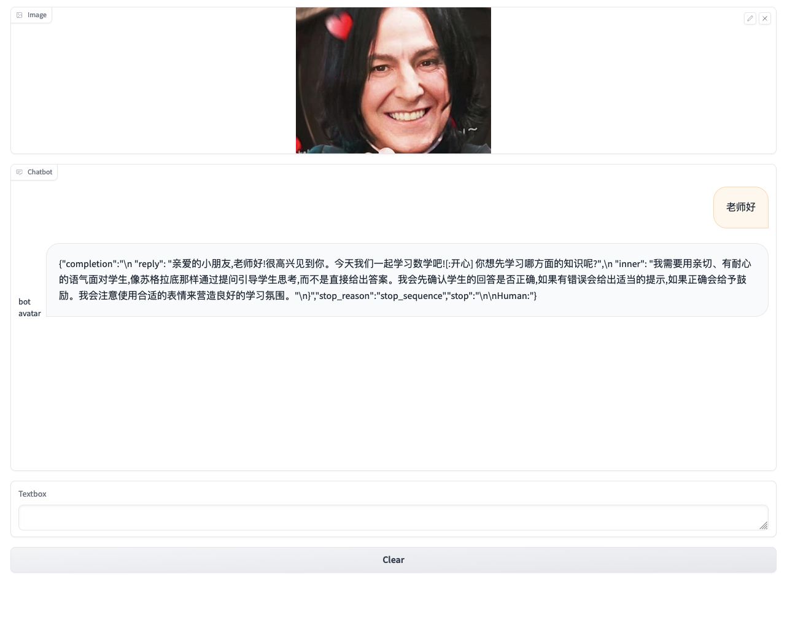

# Intelligent NPC Chatbot based on Bedrock Foundation Model

This project utilizes the [Amazon Bedrock](https://aws.amazon.com/bedrock/) Claude model and Llama2 model to simulate virtual characters and uses FM's instruct capability to enable NPCs to have synchronized facial expressions. 

This project simulates a math teacher and Taylor Swift. Through this experiment, you can experience Claude's controllability and use it to provide more interesting experiences for game players in SLG and UGC game scenarios.

## Environment Setup

- Clone the git project to your local directory
```
git clone https://github.com/RichardLeeY/HiNPC.git
```

- Install Python 3.9 - Recommend using [pyenv](https://github.com/pyenv/pyenv#readme) for Python version management or directly upgrade your system Python version to 3.9

- Upgrade boto3 to the latest version and awscli to a suitable version
```
pip install --no-build-isolation --force-reinstall     "boto3>=1.28.57"     "awscli>=1.29.57"     "botocore>=1.31.57" 
```

- Install project dependencies
```
pip install -r requirements.txt
```

## Code Structure
```
- images/ Image paths
- notebooks/ Jupyter notebooks for testing inference effects
    - pe-famous-taylor-v1105.ipynb Famous person prompt testing
    - pe-math-elementry-v1105.ipynb Prompt design and testing for special scenarios
```

## Level 1 Run

- Chat with Taylor Swift - Observe Taylor's facial expression changes during the chat
```
python Chatbot-Taylor.py
```
After successful startup, visit http://127.0.0.1:7860/ to see the chat window below. You can happily chat with Taylor Swift.


- Chat with a math teacher
```
python Chatbot-teacher.py
```
After successful startup, visit http://127.0.0.1:7860/ to see the chat window below. You can happily chat with the elementary school teacher.




## Level 2 Add synchronized audio output capability to Taylor chat.

- Grant Amazon Polly calling permissions to the current EC2 instance role or AKSK corresponding user
```
{
   "Version": "2012-10-17",
   "Statement": [{
      "Sid": "AllowSynthesizeSpeech",
      "Effect": "Allow",
      "Action": [
         "polly:SynthesizeSpeech",
      ]
      "Resource": "*"
      }
   ]
}
```

Use AWS Polly for audio output. Need to install ffmpeg libraries

For MAC
```
brew install ffmpeg
```

For Ubuntu
``` 
sudo apt update
sudo apt install ffmpeg
```

## Level 2 Run

- Chat with Taylor Swift - Taylor will respond to you with voice. You can observe the changes in tone and speed of her voice.

```
python Chatbot-Taylor-AmazonPolly.py
```

After successful startup, visit http://127.0.0.1:7860/ to start chatting. Here's a video of the chat:

[](./images/Taylor-polly.mov)