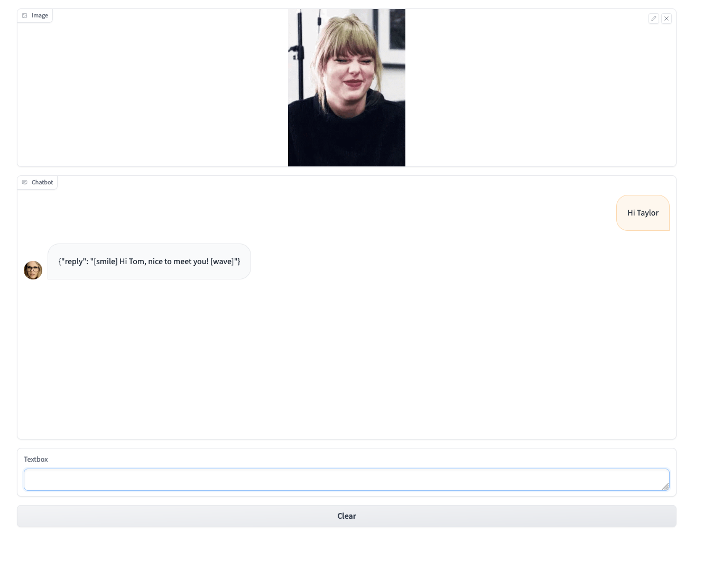
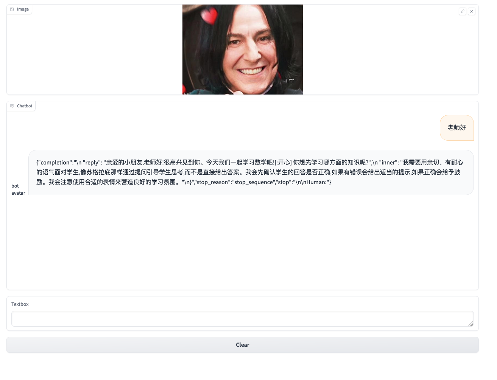

# 基于Claude 模型的智能NPC
此项目基于[Amazon Bedrock](https://aws.amazon.com/bedrock/) 的Claude模型能力，实现了虚拟人物的模拟，并且通过claude的instruct能力，赋予NPC 联动表情的能力。

本项目完成了一位数学老师，和Tayler Swift的模拟。通过此实验，您可以体验到Claude模型的控制能力，基于此可以在SLG，UGC游戏场景中为游戏玩家提供更有趣的体验。


## 环境准备
- 下载git项目到您的本机目录
```
git clone https://github.com/RichardLeeY/HiNPC.git
```
- 安装python3.9  推荐采用[pyenv](https://github.com/pyenv/pyenv#readme)做python版本管理，也可以直接升级本机python版本到3.9

- 升级boto3到最新版本,awscli到合适的版本
```
pip install --no-build-isolation --force-reinstall \
    "boto3>=1.28.57" \
    "awscli>=1.29.57" \
    "botocore>=1.31.57"
```
- 安装项目依赖包
```
pip install -r requirements.txt
```

## 代码目录介绍
```
- images/  图片路径
- notebooks/ 测试推理效果的jupitor notebook
    - pe-famous-taylor-v1105.ipynb  名人prompt词测试
    - pe-math-elementry-v1105.ipynb 特别场景的prompt设计与测试

```

## 运行
- 与Tayler swift聊天 随着聊天的进行，可以观察到Taylor的表情变化
```
python Chatbot-Taylor.py
```
启动成功后， 访问地址 http://127.0.0.1:7860/ 显示如下聊天窗口。您就可以开心的Taylor Swift 交流了。




- 与数学老师聊天
```
python Chatbot-teacher.py
```
启动成功后， 访问地址 http://127.0.0.1:7860/ 显示如下聊天窗口。您就可以开心的与小学老师交流了。



## 选择2
采用AWS Polly 实现语音输出，


